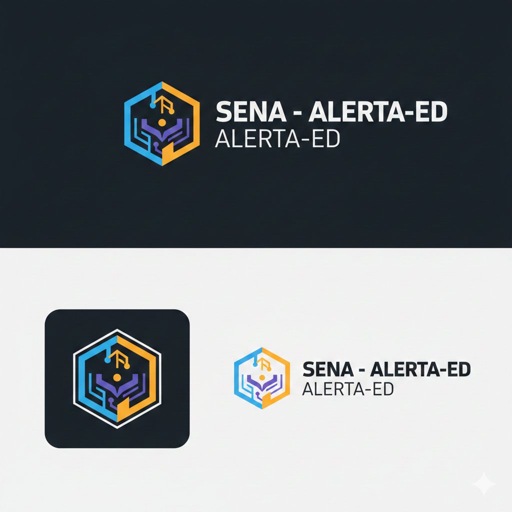

# SENA - ALERTA-ED


Dashboard/presentacion web interactiva para demostrar un sistema de alerta temprana contra la desercion escolar, con enfoque preventivo, narrativa visual y UX orientada a pitch academico/profesional.

## Vision del proyecto

**ALERTA-ED** propone detectar riesgo de abandono antes de que sea irreversible.  
La experiencia integra:

- Mascota IA **SENA** con onboarding por rol.
- Visualizaciones y secciones narrativas para presentar el caso.
- Interfaz optimizada para proyector y funcionamiento sin internet.

## Demo y branding en GitHub

Para que el repo luzca mejor en publico:

1. Genera un logo y portada con los prompts de [branding/GEMINI-NANO-BANANA-PROMPTS.md](branding/GEMINI-NANO-BANANA-PROMPTS.md)
2. Sube los archivos a `assets/github/` con estos nombres:
   - `logo-sena-alertaed.png`
   - `cover-sena-alertaed.png`
3. Descomenta estas lineas:

```md
<!--  -->
<!--  -->
```

## Estado tecnico

- Build validado.
- TypeScript sin errores.
- Recursos locales (imagen/video) funcionando en modo offline.
- Estructura de proyecto preparada para despliegue en Vercel.

## Stack

- Vite 5
- React 18
- TypeScript 5
- Tailwind CSS 3
- Framer Motion 11
- Lucide React

## Estructura del repositorio

- `dashboard/`: aplicacion frontend principal.
- `design-system/`: sistema de diseno, tokens y reglas visuales.
- `tasks/`: seguimiento de tareas.
- `AGENT-SYNC.md`: bitacora de sesiones y handoffs.
- `CLAUDE.md`: arquitectura y lineamientos operativos.

## Ejecutar localmente

```bash
cd dashboard
npm install
npm run dev
```

Build de produccion:

```bash
cd dashboard
npm run build
npm run preview
```

## Deploy en Vercel

Configuracion recomendada:

- Root Directory: `dashboard`
- Framework Preset: `Vite`
- Build Command: `npm run build`
- Output Directory: `dist`

## Seguridad y propiedad intelectual

Este repositorio se publica para demostracion, manteniendo propiedad intelectual del autor.

- [LICENSE](LICENSE)
- [NOTICE](NOTICE)
- [SECURITY.md](SECURITY.md)
- [CONTRIBUTING.md](CONTRIBUTING.md)

No se permite uso, copia, modificacion, redistribucion ni explotacion comercial sin autorizacion expresa y por escrito del titular.

## Autor

- Martin Bundy
